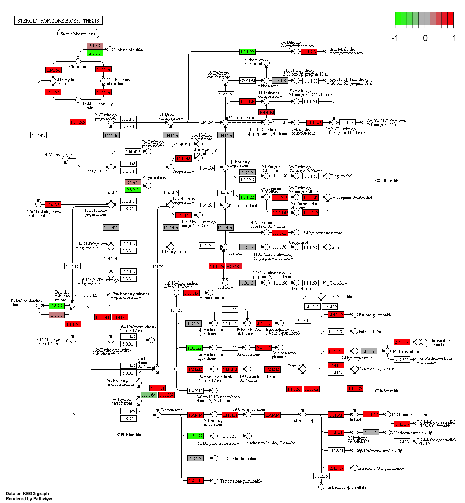
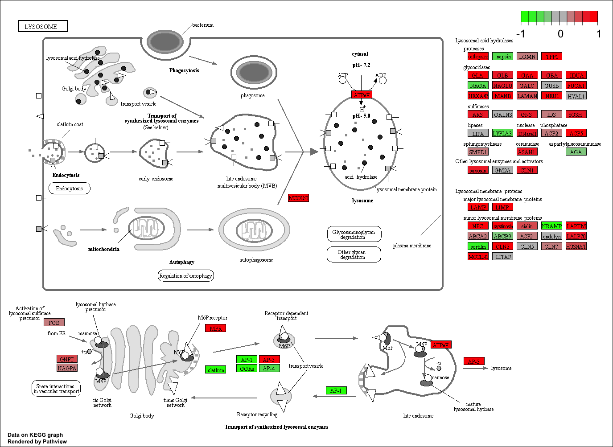
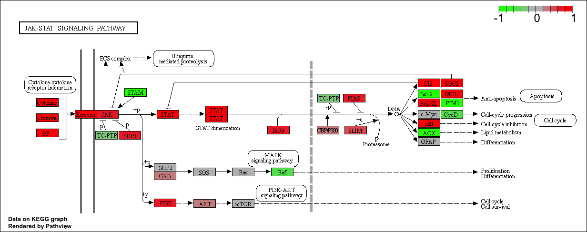
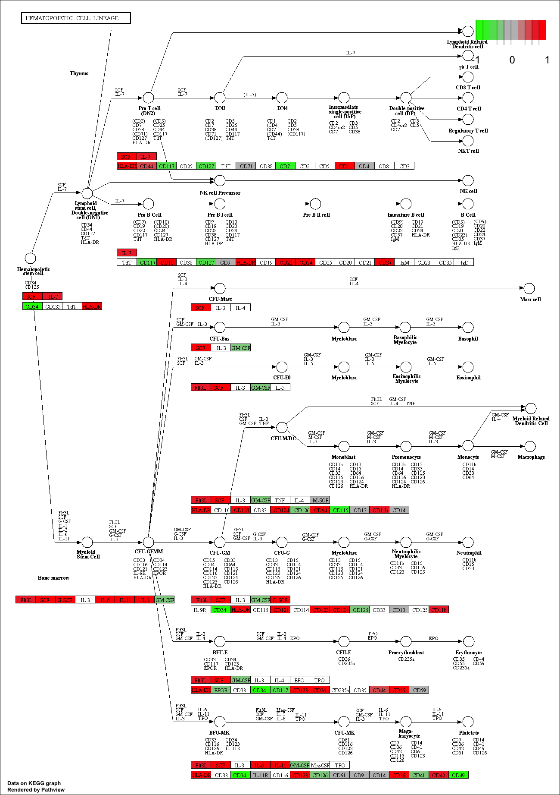
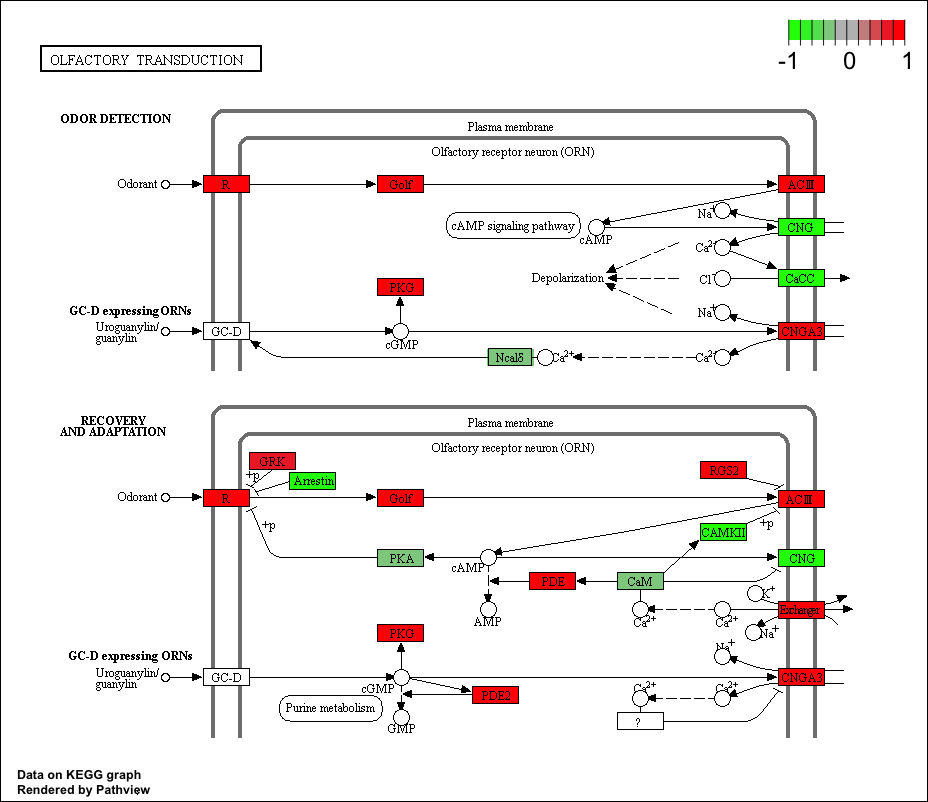

```{r setup, include=FALSE}
knitr::opts_chunk$set(echo = TRUE)
```

# Pathway analysis from RNA-seq differential expression results

## Overview
Analysis of high-throughput biological data typically yields a list of genes or proteins requiring further interpretation - for example the ranked lists of differentially expressed genes we have been generating from our RNA-seq analysis to date. 

Our intention is typically to use such lists to gain novel insights about genes and proteins that may have roles in a given phenomenon, phenotype or disease progression. However, in many cases these 'raw' gene lists are challenging to interpret due to their large size and lack of useful annotations. Hence, our expensively assembled gene lists often fail to convey the full degree of possible insight about the condition being studied. 

Pathway analysis (also known as gene set analysis or over-representation analysis), aims to reduce the complexity of interpreting gene lists via mapping the listed genes to known (i.e. annotated) biological pathways, processes and functions. 

> **Side-note**: Pathway analysis can actually mean many different things to different people. This includes analysis of Gene Ontology (GO) terms, protein–protein interaction networks, flux-balance analysis from kinetic simulations of pathways, etc. However, pathway analysis most commonly focuses on methods that exploit existing pathway knowledge (e.g. in public repositories such as GO or KEGG), rather than on methods that infer pathways from molecular measurements. These more general approaches are nicely reviewed in this paper: 
>
> - Khatri, et al. "*Ten years of pathway analysis: current approaches and outstanding challenges*." [PLoS Comput Biol 8.2 (2012): e1002375](http://journals.plos.org/ploscompbiol/article?id=10.1371/journal.pcbi.1002375).

### Patway analysis with R and Bioconductor
There are many freely available tools for pathway or over-representation analysis. As of Nov 2017 Bioconductor alone has over [80 packages categorized under gene set enrichment](http://bioconductor.org/packages/release/BiocViews.html#___GeneSetEnrichment) and over [120 packages categorized under pathways](http://bioconductor.org/packages/release/BiocViews.html#___Pathways). 

Here we play with just one, the [**GAGE** package](https://bioconductor.org/packages/release/bioc/html/gage.html) (which stands for **G**enerally **A**pplicable **G**ene set **E**nrichment), to do KEGG pathway enrichment analysis on RNA-seq based differential expression results.

The [KEGG pathway database](http://www.genome.jp/kegg/pathway.html), unlike GO for example, provides functional annotation as well as information about gene products that interact with each other in a given pathway, how they interact (e.g., activation, inhibition, etc.), and where they interact (e.g., cytoplasm, nucleus, etc.). Hence KEGG has the potential to provide extra insight beyond annotation lists of simple molecular function, process etc. from GO terms. 

In this analysis, we check for coordinated differential expression over gene sets from KEGG pathways instead of changes of individual genes. The assumption here is that consistent perturbations over a given pathway (gene set) may suggest mechanistic changes.


### About our Input Data

The data for for hands-on session comes from GEO entry: [GSE37704](http://www.ncbi.nlm.nih.gov/geo/query/acc.cgi?acc=GSE37704), which is associated with the following publication: 

- Trapnell C, Hendrickson DG, Sauvageau M, Goff L et al. "*Differential analysis of gene regulation at transcript resolution with RNA-seq*". Nat Biotechnol 2013 Jan;31(1):46-53. [PMID: 23222703](https://www.ncbi.nlm.nih.gov/pubmed/23222703)

The authors report on differential analysis of lung fibroblasts in response to loss of the developmental transcription factor HOXA1. Their results and others indicate that HOXA1 is required for lung fibroblast and HeLa cell cycle progression. In particular their analysis show that "loss of HOXA1 results in significant expression level changes in thousands of individual transcripts, along with isoform switching events in key regulators of the cell cycle". For our session we have used their [Sailfish](https://www.nature.com/articles/nbt.2862) gene-level estimated counts and hence are restricted to protein-coding genes only. 

## Section 1. Differential Expression Analysis 

You can download the count data and associated metadata from here: [GSE37704_featurecounts.csv](https://bioboot.github.io/bimm143_W18/class-material/GSE37704_featurecounts.csv) and [GSE37704_metadata.csv](https://bioboot.github.io/bimm143_W18/class-material/GSE37704_metadata.csv). This is similar to our starting point for the last class where we used DESeq2 for the first time. We will use it again today!


```{r, warning=FALSE, results=FALSE, message=FALSE}
#library(dplyr)
library(DESeq2)
```

Load our data files

```{r}
metaFile <- "data/GSE37704_metadata.csv"
countFile <- "data/GSE37704_featurecounts.csv"

# Import metadata and take a peak
colData = read.csv(metaFile, row.names=1)
head(colData)


# Import countdata
countData = read.csv(countFile, row.names=1)
head(countData)
```

Hmm... remember that we need the `countData` and `colData` files to match up so we will need to remove that odd first column in `countData` namely `contData$length`.

```{r}
# Note we need to remove the odd first $length col
countData <- as.matrix(countData[,-1])
head(countData)
```

This looks better but there are lots of zero entries in there so let's get rid of them as we have no data for these.

```{r}
# Filter count data where you have 0 read count across all samples.
countData = countData[rowSums(countData)>1, ]
head(countData)
```


Nice now lets setup the DESeqDataSet object required for the **DESeq()** function and then run the DESeq pipeline. This is again similar to our last days hands-on session.

```{r}
dds = DESeqDataSetFromMatrix(countData=countData,
                             colData=colData,
                             design=~condition)
dds = DESeq(dds)
dds
```

Next, get results for the HoxA1 knockdown versus control siRNA (remember we labeled these as "**hoxa1_kd**" and "**control_sirna**" in our original `colData` metaFile input to DESeq, you can check this above and by running `resultsNames(dds)` command). 

```{r}
res = results(dds, contrast=c("condition", "hoxa1_kd", "control_sirna"))
```

Let's reorder these results by p-value and call summary() on the results object to get a sense of how many genes are up or down-regulated at the default FDR of 0.1.

```{r}
res = res[order(res$pvalue),]
summary(res)
```

Since we mapped and counted against the Ensembl annotation, our results only have information about Ensembl gene IDs. However, our pathway analysis downstream will use KEGG pathways, and genes in KEGG pathways are annotated with Entrez gene IDs. So lets add them as we did the last day. 

```{r, warning=FALSE, message=FALSE}
library("AnnotationDbi")
library("org.Hs.eg.db")

columns(org.Hs.eg.db)

res$symbol = mapIds(org.Hs.eg.db,
                    keys=row.names(res), 
                    column="SYMBOL",
                    keytype="ENSEMBL",
                    multiVals="first")

res$entrez = mapIds(org.Hs.eg.db,
                    keys=row.names(res), 
                    column="ENTREZID",
                    keytype="ENSEMBL",
                    multiVals="first")

res$name =   mapIds(org.Hs.eg.db,
                    keys=row.names(res), 
                    column="GENENAME",
                    keytype="ENSEMBL",
                    multiVals="first")

head(res, 10)
```

Great, this is looking good so far. Now lets see how pathway analysis can help us make further sense out of this ranked list of differentially expressed genes.


## Section 2. Pathway Analysis
Here we are going to use the [**gage**]() package for pathway analysis. Once we have a list of enriched pathways, we're going to use the [**pathview**]() package to draw pathway diagrams, shading the molecules in the pathway by their degree of up/down-regulation.

### KEGG pathways

The **gageData** package has pre-compiled databases mapping genes to KEGG pathways and GO terms for common organisms. `kegg.sets.hs` is a named list of 229 elements. Each element is a character vector of member gene Entrez IDs for a single KEGG pathway. (See also `go.sets.hs`). The `sigmet.idx.hs` is an index of numbers of signaling and metabolic pathways in `kegg.set.gs`. In other words, KEGG pathway include other types of pathway definitions, like "Global Map" and "Human Diseases", which may be undesirable in pathway analysis. Therefore, `kegg.sets.hs[sigmet.idx.hs]` gives you the "cleaner" gene sets of signaling and metabolic pathways only.


> **Side-Note**: While there are many freely available tools to do pathway analysis, and some like gage are truly fantastic, many of them are poorly maintained or rarely updated. The DAVID tool that a lot of folks use for simple gene set enrichment analysis was not updated at all between Jan 2010 and Oct 2016.

First we need to do our one time install of these required bioconductor packages:

```{r, eval=FALSE}
source("http://bioconductor.org/biocLite.R")
biocLite( c("pathview", "gage", "gageData") )
```

Now we can load the packages and setup the KEGG data-sets we need.

```{r, warning=FALSE}
library(pathview)
library(gage)
library(gageData)

data(kegg.sets.hs)
data(sigmet.idx.hs)

kegg.sets.hs = kegg.sets.hs[sigmet.idx.hs]
head(kegg.sets.hs, 3)
```

The main **gage()** function requires a named vector of fold changes, where the names of the values are the Entrez gene IDs.

```{r}
foldchanges = res$log2FoldChange
names(foldchanges) = res$entrez
head(foldchanges)
```

Now, let’s run the pathway analysis. See help on the gage function with `?gage`. Specifically, you might want to try changing the value of `same.dir`. This value determines whether to test for changes in a gene set toward a single direction (all genes up or down regulated) or changes towards both directions simultaneously (i.e. any genes in the pathway dysregulated).

Here, we're using `same.dir=TRUE`, which will give us separate lists for pathways that are upregulated versus pathways that are down-regulated. Let’s look at the first few results from each.

```{r}
# Get the results
keggres = gage(foldchanges, gsets=kegg.sets.hs, same.dir=TRUE)
```

Lets look at the result object. It is a list with three elements ("greater", "less" and "stats").

```{r}
attributes(keggres)
```

So it is a list object (you can check it with `str(keggres)`) and we can use the dollar syntax to access a named element, e.g.

```{r}
head(keggres$greater)
head(keggres$less)
```

Each `keggres$greater` and `keggres$less` object is data matrix with gene sets as rows sorted by p-value. Lets look at both up (greater), down (less), and statistics by calling **head()** with the **lapply()** function. As always if you want to find out more about a particular function or its return values use the R help system (e.g. `?gage` or `?lapply`).

```{r}
lapply(keggres, head)
```

Now, let's process the results to pull out the top 5 upregulated pathways, then further process that just to get the IDs. We’ll use these KEGG pathway IDs downstream for plotting.

```{r}
## Sanity check displaying all pathways data
pathways = data.frame(id=rownames(keggres$greater), keggres$greater)
head(pathways)
```

Now, let's try out the **pathview()** function from the [pathview package](https://bioconductor.org/packages/release/bioc/html/pathview.html) to make a pathway plot with our result shown in color. To begin with lets manually supply a `pathway.id` (namely the first part of the `"hsa04110 Cell cycle"`) that we could see from the print out above.

```{r}
pathview(gene.data=foldchanges, pathway.id="hsa04110")
```

This downloads the patway figure data from KEGG and adds our results to it. You can play with the other input arguments to **pathview()** to change the dispay in various ways including generating a PDF graph. For example:

```{r}
# A different PDF based output of the same data
pathview(gene.data=foldchanges, pathway.id="hsa04110", kegg.native=FALSE)
```

Here is the default low resolution raster PNG output from the first pathview() call above:


Note how many of the genes in this pathway are pertubed (i.e. colored) in our results.

Now, let's process our results a bit more to automagicaly pull out the top 5 upregulated pathways, then further process that just to get the IDs needed by the **pathview()** function. We'll use these KEGG pathway IDs for plotting below.

```{r}
## Focus on top 5 upregulated pathways here for demo purposes only
keggrespathways <- rownames(keggres$greater)[1:5]

# Extract the IDs part of each string
keggresids = substr(keggrespathways, start=1, stop=8)
keggresids
```

Finally, lets pass these IDs in `keggresids` to the **pathview()** function to draw plots for all the top 5 pathways.

```{r, warning=FALSE, results=FALSE, message=FALSE}
pathview(gene.data=foldchanges, pathway.id=keggresids, species="hsa")
```

Here are the plots:












# Section 3. Gene Ontology (GO)
We can also do a similar procedure with gene ontology. Similar to above, go.sets.hs has all GO terms. go.subs.hs is a named list containing indexes for the BP, CC, and MF ontologies. Let’s only do Biological Process.

```{r}
data(go.sets.hs)
data(go.subs.hs)
gobpsets = go.sets.hs[go.subs.hs$BP]

gobpres = gage(foldchanges, gsets=gobpsets, same.dir=TRUE)

lapply(gobpres, head)
```

## Section 4. Reactome Pathway Analysis

Reactome is database consisting of biological molecules and their relation to pathways and processes. Reactome, such as many other tools, has an online software available (<https://reactome.org/>) and R package available (<https://bioconductor.org/packages/release/bioc/html/ReactomePA.html>).  

If you would like more information, the documentation is available here: <https://reactome.org/user/guide>

Let's now conduct over-representation enrichment analysis and pathway-topology analysis with Reactome using the previous list of significant genes generated from our differential expression results above.

First, Using R, output the list of significant genes at the 0.05 level as a plain text file:

```{r}
sig_genes <- res[res$padj <= 0.05 & !is.na(res$padj), "symbol"]
print(paste("Total number of significant genes:", length(sig_genes)))
```

```{r}
write.table(sig_genes, file="significant_genes.txt", row.names=FALSE, col.names=FALSE, quote=FALSE)
```

Then, to perform pathway analysis online go to the Reactome website (<https://reactome.org/PathwayBrowser/#TOOL=AT>). Select “choose file” to upload your significant gene list. Then, select the parameters “Project to Humans”, then click “Analyze”.  

> **Question**: What pathway has the most significant “Entities p-value”? Do the most significant pathways listed match your previous KEGG results? What factors could cause differences between the two methods?  


## Section 5. GO Analysis

Gene Set Gene Ontology (GO) Enrichment is a method to determine over-represented or under-represented GO terms for a given set of genes. GO terms are formal structured controlled vocabularies (ontologies) for gene products in terms of their biological function. The goal of this analysis is to determine the biological process the given set of genes are associated with.

To perform Gene Set GO Enrichment online go to the website <http://www.geneontology.org/page/go-enrichment-analysis>. Paste your significant gene list from section 4. Then, select "biological process" and "homo sapiens", and click submit.

> **Question**: What pathway has the most significant “Entities p-value”? Do the most significant pathways listed match your previous KEGG results? What factors could cause differences between the two methods?  


## Session Information
The `sessionInfo()` prints version information about R and any attached packages. It's a good practice to always run this command at the end of your R session and record it for the sake of reproducibility in the future.

```{r sessionInfo}
sessionInfo()
```


