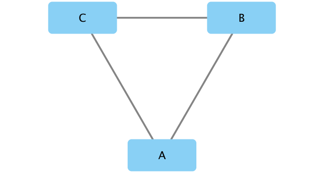
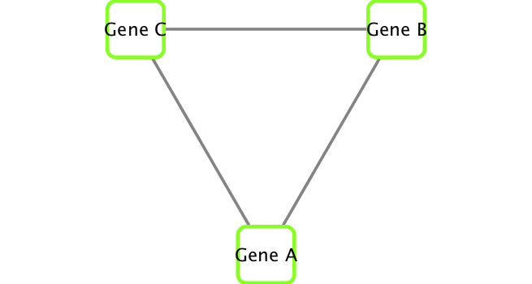
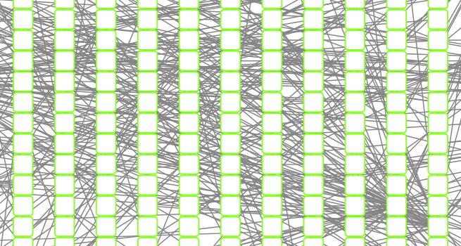
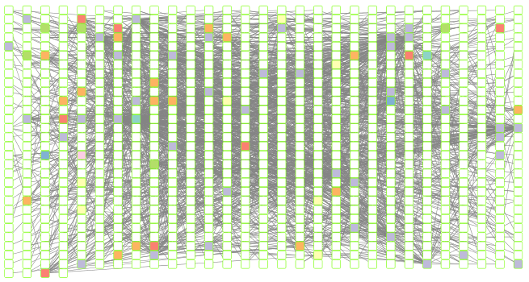
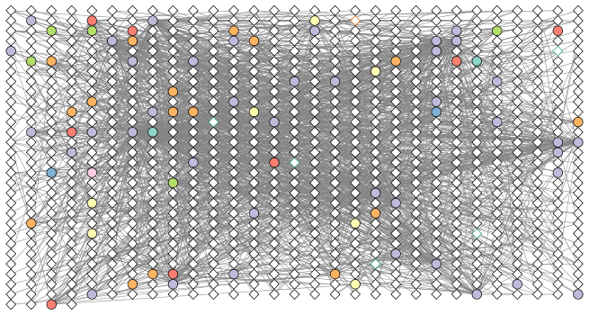
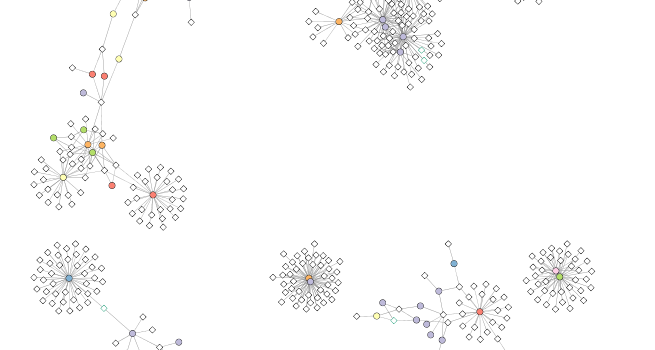
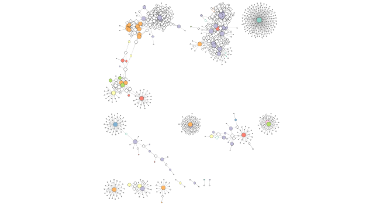
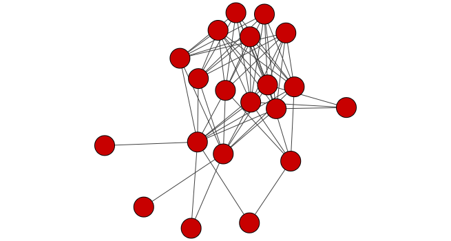

```{r setup, include=FALSE}
knitr::opts_chunk$set(echo = TRUE)
```

**BIMM-143 Lecture 17:**  
Barry Grant &lt; <http://thegrantlab.org> &gt;  
Date: 2018-03-05   (17:19:13 PST on Mon, Mar 05)  
{:.message}  


# Overview

## Tara Oceans

Many projects have collected samples from different regions and from different depths of the ocean. Some, such as the pioneering study by Craig Venter [@venter_environmental_2004] have pioneered metagenomic sequencing and others, such as [Tara Oceans Expedition](http://oceans.taraexpeditions.org/) have collected large amounts of data with global ecological questions in mind. On the Tara Oceans ([8th and 9th expedition for this vessel ](http://oceans.taraexpeditions.org/en/m/about-tara/les-expeditions/tara-oceans/)) researchers used a small sailboat outfitted with a lab and filtration supplies to collect samples from many different size fractions of microorganisms in the oceans over three years. They collected these samples to look at the different kinds of microorganisms present in different parts of the oceans to look at their composition and to observe their spatial patterns and distribution. 

The scientists collected the samples and then used either targeted sequencing (amplicon approach using primers for specific targets such as the ribosomal genes and then amplifying these targets using PCR) or using metagenomic sequencing (where all the genetic material in a sample is sequenced) of each of the size fractions.

After the sequencing and quality checking of the samples was done, the sequences were taxonomically classified (different approaches for the different targets, see here for the details in @brum_patterns_2015 and @sunagawa_structure_2015). After that the data could be made into a species occurrence table where the rows are different sites and the columns are the observations of the different organisms at each site [@lima-mendez_determinants_2015].

## How to examine organisms that occur together: co-occurence networks

Many of these microbial species in these types of studies have not yet been characterized in the lab. Thus, to know more about the organisms and their interactions, we can observe which ones occur at the same sites or under the same kinds of environmental conditions. One way to do that is by using co-occurrence networks where you examine which organisms occur together at which sites. The more frequently that organisms co-occur at the same site, the stronger the interaction predicted among these organisms. For a review of some of the different kinds of techniques and software for creating interaction networks see: @weiss_correlation_2016.

## What can we find out by creating co-occurence networks?

These kinds of analyses can be useful for studies where the organisms have not yet been characterized in the lab because these analyses can provide insights about the communities and how the organisms within them are interacting. These analyses can be exploratory, so that we can see which organisms warrant further insights and perhaps experimental work. We can also learn about how the overall community is organized (community structure) by looking at some of the network properties (that is the overall way that the organisms are co-occurring and the properties of the network seen this way).

## Our data for this hands-on section

In this analysis we are using a Tara Ocean data and we have data from the bacterial dataset [@sunagawa_structure_2015]  and also from the viral dataset [@brum_patterns_2015]. They have been examined in @lima-mendez_determinants_2015 and we have used the original relative abundances to visualize the data. Data were retrieved from: http://www.raeslab.org/companion/ocean-interactome.html

# Set up Cytoscape and R connection

We will run this example using the R bioconductor package **RCy3** (see: [http://bioconductor.org/packages/release/bioc/html/RCy3.html](http://bioconductor.org/packages/release/bioc/html/RCy3.html) ) to drive the visualization of these networks in **Cytoscape** (see: [http://cytoscape.org](http://cytoscape.org) ).

## Requirements
```{r, message=FALSE, warning=FALSE}
library(RCy3)
library(igraph)
library(RColorBrewer)
```

If you received an error message or have not installed any of these packages yet then you will likely need to do a one-time only package install within R, e.g.

### Installation
```{r, echo=F, eval=F}
source("https://bioconductor.org/biocLite.R")
biocLite("RCy3")
install.packages(c("igraph","RColorBrewer"))
```

The whole point of RCy3 package is to connect with Cytoscape. You will need to install and launch Cytoscape if you have not already done so: 

* [Download Cytoscape](http://www.cytoscape.org/download.php) 
* Complete the installation wizard
* Launch Cytoscape 


> **NOTE**: To run this lab the **Cytoscape software must be running** (i.e. you should have it installed and open!). 


### First Contact
These functions are a convenient way to verify a connection to Cytoscape and for logging the versions of CyREST and Cytoscape in your scripts.


```{r, first_contact}
library(RCy3)
cwd <- demoSimpleGraph()
layoutNetwork(cwd, 'force-directed')

# choose any of the other possible layouts e.g.:
possible.layout.names <- getLayoutNames(cwd)
layoutNetwork (cwd, possible.layout.names[1])

# Test the connection to Cytoscape.
ping(cwd)
```

If you turn to your Cytoscape window you should now see a simple 3 vertex and 3 edge network displayed (see below).  

```{r, echo=FALSE}
saveImage(cwd,
          "lecture17_BIMM143_W18_files/demo",
          "png",
          h=350)
```

```{r, echo=FALSE}

```

### Switch Styles
Cytoscape provides a number of canned visual styles. The code below explores some of these styles. For example check out the marquee style!
```{r, eval=F}
setVisualStyle(cwd, "Marquee")
```

If you turn to your Cytoscape window you should now see an updated stylized network displayed (see below).  

```{r, echo=FALSE}
saveImage(cwd,
          "lecture17_BIMM143_W18_files/demo_marquee",
          "png",
          h=350)
```


```{r, echo=FALSE}

```

You can find out what other styles are available and try a couple:

```{r}
styles <- getVisualStyleNames(cwd)
styles
```

Let try some other styles, e.g.

```{r}
#setVisualStyle(cwd, styles[13])
#setVisualStyle(cwd, styles[18])
```

Now we know that out connection between R and Cytoscape is running we can get to work with our real metagenomics data. Our first step is to read our data into R itself.


## Read our metagenomics data

We will read in a species co-occurrence matrix that was calculated using Spearman Rank coefficient. (see reference @lima-mendez_determinants_2015 for details).

```{r read-in-data}
## scripts for processing located in "inst/data-raw/"
prok_vir_cor <- read.delim("./data/virus_prok_cor_abundant.tsv", stringsAsFactors = FALSE)

## Have a peak at the first 6 rows
head(prok_vir_cor)
```

There are many different ways to work with graphs in R. We will primarily use the **igraph** package (see: [http://igraph.org/r/](http://igraph.org/r/) ) to work with our network with Cytoscape.

Here we will use the igraph package to convert the co-occurrence dataframe into a network that we can send to Cytoscape. In this case our graph is undirected (so we will set `directed = FALSE`) since we do not have any information about the direction of the interactions from this type of data. 

```{r}
g <- graph.data.frame(prok_vir_cor, directed = FALSE)
```


We can check the class of our new object `g` and see that is is of class `igraph`. Therefor the **print.igraph()** function will be called when we type it's name allowing us have an informative overview of the graph structure. 

```{r}
class(g)
g
```

In this case the first line of output ("**UNW- 854 1544 --**") tells that our network graph has 845 vertices (i.e. nodes, which represent our bacteria and viruses) and 1544 edges (i.e. linking lines, which indicate their co-occurrence). Note that the first four characters (i.e. the "**UNW-**" part) tell us about the network setup. In this case our network is **U**ndirected, **N**amed (i.e. has the 'name' node/vertex attribute set) and **W**eighted (i.e. the 'weight' edge attribute is set).

Common igraph functions for creating network graphs include: **graph_from_data_frame()**, **graph_from_edgelist()**, and **graph_from_adjacency_matrix()**.  You can find out more about these functions from their associated help pages.

Our current graph is a little too dense in terms of node labels etc. to have a useful 'default' plot figure. But we can have a look anyway. 

```{r, fig.width=4}
plot(g)
```

Not very pretty! We can tune lots of plot attributes (see the help page `?igraph.plotting` for details). Here we turn down our vertex size from the default value of 15 and turn of our vertex labels. 

```{r, fig.width=4}
plot(g, vertex.size=3, vertex.label=NA)
```

Note that we can query (and set) vertex and edge attributes with the **V()** and **E()** functions respectively: 

```{r}
V(g)
E(g)
```

There are also the functions **vertex.attributes()** and **edge.attributes()** that query all vertex and edge attributes of a igraph object. We will use one of these functions in the next section below.


# Read in taxonomic classification

Since these are data from small, microscopic organisms that were sequenced using shotgun sequencing, we rely on the classification of the sequences to know what kind of organisms are in the samples. In this case the bacterial viruses (bacteriophage), were classified by Basic Local Alignment Search Tool (BLAST http://blast.ncbi.nlm.nih.gov/Blast.cgi) by searching for their closest sequence in the RefSeq database (see methods in @brum_patterns_2015). The prokaryotic taxonomic classifications were determined using the [SILVA database](https://www.arb-silva.de/).

```{r}
phage_id_affiliation <- read.delim("./data/phage_ids_with_affiliation.tsv")
head(phage_id_affiliation)
```

```{r}
bac_id_affi <- read.delim("./data/prok_tax_from_silva.tsv")
head(bac_id_affi)
```

# Add the taxonomic classifications to the network and then send network to Cytoscape

In preparation for sending the networks to Cytoscape we will add in the taxonomic data. Some of the organisms do not have taxonomic classifications associated with them so we have described them as "not_class" for not classified. We do that because we have had problems sending "NA"s to Cytoscape from RCy3. The RCy3 package is under active development currently so this *issue* will hopefully be resolved soon.

```{r}
## Create our gene network 'genenet' for cytoscape
genenet.nodes <- as.data.frame(vertex.attributes(g))

## not all have classification, so create empty columns
genenet.nodes$phage_aff <- rep("not_class", nrow(genenet.nodes))
genenet.nodes$Tax_order <- rep("not_class", nrow(genenet.nodes))
genenet.nodes$Tax_subfamily <- rep("not_class", nrow(genenet.nodes))

for (row in seq_along(1:nrow(genenet.nodes))){
  if (genenet.nodes$name[row] %in% phage_id_affiliation$first_sheet.Phage_id_network){
    id_name <- as.character(genenet.nodes$name[row])
    aff_to_add <- unique(subset(phage_id_affiliation,
                                first_sheet.Phage_id_network == id_name,
                                select = c(phage_affiliation,
                                           Tax_order,
                                           Tax_subfamily)))
    genenet.nodes$phage_aff[row] <- as.character(aff_to_add$phage_affiliation)
    genenet.nodes$Tax_order[row] <- as.character(aff_to_add$Tax_order)
    genenet.nodes$Tax_subfamily[row] <- as.character(aff_to_add$Tax_subfamily)
  }
}
```

```{r}
## do the same for proks
genenet.nodes$prok_king <- rep("not_class", nrow(genenet.nodes))
genenet.nodes$prok_tax_phylum <- rep("not_class", nrow(genenet.nodes))
genenet.nodes$prok_tax_class <- rep("not_class", nrow(genenet.nodes))

for (row in seq_along(1:nrow(genenet.nodes))){
  if (genenet.nodes$name[row] %in% bac_id_affi$Accession_ID){
    aff_to_add <- unique(subset(bac_id_affi,
                                Accession_ID == as.character(genenet.nodes$name[row]),
                                select = c(Kingdom,
                                           Phylum,
                                           Class)))
    
    genenet.nodes$prok_king[row] <- as.character(aff_to_add$Kingdom)
    genenet.nodes$prok_tax_phylum[row] <- as.character(aff_to_add$Phylum)
    genenet.nodes$prok_tax_class[row] <- as.character(aff_to_add$Class)
  }
}
```

Add to the network the data related to the connections between the organisms, the edge data, and then prepare to send the nodes and edges to Cytoscape using the function `cyPlot()`.

```{r}
genenet.edges <- data.frame(igraph::as_edgelist(g))
names(genenet.edges) <- c("name.1",
                          "name.2")
genenet.edges$Weight <- igraph::edge_attr(g)[[1]]

genenet.edges$name.1 <- as.character(genenet.edges$name.1)
genenet.edges$name.2 <- as.character(genenet.edges$name.2)
genenet.nodes$name <- as.character(genenet.nodes$name)

ug <- cyPlot(genenet.nodes,genenet.edges)
```

## Send network to Cytoscape using RCy3

Now we will send the network from R to Cytoscape.  

To begin we create a connection in R that we can use to manipulate the networks and then we will delete any windows that were already in Cytoscape so that we don't use up all of our memory. 

```{r}
cy <- CytoscapeConnection()
deleteAllWindows(cy)
```

If you tun back to your Cytoscape window you should now see that all previous networks have been removed from the open display.

```{r, message=FALSE}
cw <- CytoscapeWindow("Tara oceans",
                      graph = ug,
                      overwriteWindow = TRUE)
```

If you tun back to your Cytoscape window you should now see a new Network window listed as "Tara oceans". However, as of yet there will be no network graph displayed as we have not called the **displayGraph()** function to Cytoscape yet.

```{r, message=FALSE, results="hide"}
displayGraph(cw)
layoutNetwork(cw)
fitContent(cw)
```

```{r, echo=FALSE}
saveImage(cw,
          "lecture17_BIMM143_W18_files/co-occur0",
          "png",
          h=350)

```

Our network display of our data is now there in Cytoscape. It is just not very pretty yet! We will work on this next few sections.


## Colour network by prokaryotic phylum

We would like to get an overview of the different phylum of bacteria that are in the network. One way is to color the different nodes based on their phylum classification. The package Rcolorbrewer will be used to generate a set of good colors for the nodes. 

```{r}
families_to_colour <- unique(genenet.nodes$prok_tax_phylum)
families_to_colour <- families_to_colour[!families_to_colour %in% "not_class"]
node.colour <- RColorBrewer::brewer.pal(length(families_to_colour), "Set3")
```

Use the colors from Rcolorbrewer to color the nodes in Cytoscape.

```{r}
setNodeColorRule(cw,
                 "prok_tax_phylum",
                 families_to_colour,
                 node.colour,
                 "lookup",
                 default.color = "#ffffff")
```


```{r, message=FALSE, results="hide"}
displayGraph(cw)
layoutNetwork(cw)
fitContent(cw)
```

```{r, echo=FALSE}
saveImage(cw,
          "lecture17_BIMM143_W18_files/co-occur0_1",
          "png",
          h=350)

```

## Set node shape to reflect virus or prokaryote

Next we would like to change the shape of the node to reflect whether the nodes are viral or prokaryotic in origin. In this dataset all of the viral node names start with "ph_", thus we can set the viral nodes to be diamond-shaped by looking for all the nodes that start with "ph" in the network. 
```{r}
shapes_for_nodes <- c("DIAMOND")

phage_names <- grep("ph_",
                    genenet.nodes$name,
                    value = TRUE)
setNodeShapeRule(cw,
                 "label",
                 phage_names,
                 shapes_for_nodes)
```

```{r, message=FALSE, results="hide"}
displayGraph(cw)
fitContent(cw)
```

```{r, echo=FALSE}
saveImage(cw,
          "lecture17_BIMM143_W18_files/co-occur1",
          "png",
          h=350)
knitr::include_graphics("./lecture17_BIMM143_W18_files/co-occur1.png")
```

## Colour edges of phage nodes

The classification of the viral data was done in a very conservative manner so not many of the viral nodes were identified. However, if we do want to add some of this information to our visualization we can color the edges of the viral nodes by family. The main families that were identified in this dataset are the *Podoviridae*, the *Siphoviridae* and the *Myoviridae* (for more info see [NCBI Podoviridae](http://www.ncbi.nlm.nih.gov/Taxonomy/Browser/wwwtax.cgi?mode=Info&id=10744&lvl=3&p=7&lin=f&keep=1&srchmode=1&unlock), [NCBI Myoviridae](http://www.ncbi.nlm.nih.gov/Taxonomy/Browser/wwwtax.cgi?mode=Tree&id=10662&lvl=3&p=7&lin=f&keep=1&srchmode=1&unlock), and [NCBI Siphoviridae](http://www.ncbi.nlm.nih.gov/Taxonomy/Browser/wwwtax.cgi?mode=Tree&id=10699&lvl=3&p=7&lin=f&keep=1&srchmode=1&unlock))

```{r}
setDefaultNodeBorderWidth(cw, 5)
families_to_colour <- c(" Podoviridae",
                        " Siphoviridae",
                        " Myoviridae")
node.colour <- RColorBrewer::brewer.pal(length(families_to_colour),
                          "Dark2")
setNodeBorderColorRule(cw,
                       "Tax_subfamily",
                       families_to_colour,
                       node.colour,
                       "lookup", 
                       default.color = "#000000")
```

```{r, message=FALSE, results="hide"}
displayGraph(cw)
fitContent(cw)
```

```{r, echo=FALSE}
saveImage(cw,
          "lecture17_BIMM143_W18_files/co-occur2",
          "png",
          h=350)

```

## Do layout to minimize overlap of nodes. 

After doing all of this coloring to the network we would like to layout the network in a way that allows us to more easily see which nodes are connected without overlap. To do this we will change the layout. 

When using RCy3 to drive Cytoscape, if we are not sure what the current values are for a layout or we are not sure what kinds of values are accepted for the different parameters of our layout, we can investigate using the RCy3 functions `getLayoutPropertyNames()` and then `getLayoutPropertyValue()`.

```{r}
getLayoutNames(cw)
```
```{r}
getLayoutPropertyNames(cw, layout.name="force-directed")
getLayoutPropertyValue(cw, "force-directed", "defaultSpringLength") 
getLayoutPropertyValue(cw, "force-directed", "numIterations")  
```

Once we decide on the properties we want, we can go ahead and set them like this:

```{r}
#setLayoutProperties(cw,
#                    layout.name = force-directed",
#                    list(defaultSpringLength = 20,
#                         "numIterations" = 200))
#layoutNetwork(cw,
#              layout.name = "force-directed")
#fitContent(cw)
```

```{r}
layoutNetwork(cw, layout.name = "force-directed")
fitContent(cw)
```


```{r, echo=FALSE}

saveImage(cw,
          "lecture17_BIMM143_W18_files/co-occur3",
          "png", 
          h=350)

```

# Look at network properties

One thing that might be interesting to visualize is nodes that are connected to many different nodes and nodes that are connected to few other nodes. The number of other nodes to which one node is connected is called **degree**. We can use a gradient of size to quickly visualize nodes that have high degree. 

```{r}
## initiate a new node attribute
ug2 <- initNodeAttribute(graph = ug,
                          "degree",
                          "numeric",
                          0.0) 

## degree from graph package for undirected graphs not working well,
## so instead using igraph to calculate this from the original graph
nodeData(ug2, nodes(ug2), "degree") <- igraph::degree(g)

cw2 <- CytoscapeWindow("Tara oceans with degree",
                      graph = ug2,
                      overwriteWindow = TRUE)
```

```{r, message=FALSE, results="hide"}
displayGraph(cw2)
layoutNetwork(cw2)
```

# Size by degree

```{r}
degree_control_points <- c(min(igraph::degree(g)),
                           mean(igraph::degree(g)),
                           max(igraph::degree(g)))
node_sizes <- c(20,
                20,
                80,
                100,
                110) # number of control points in interpolation mode,
                     # the first and the last are for sizes "below" and "above" the attribute seen.

setNodeSizeRule(cw2,
                "degree",
                degree_control_points,
                node_sizes,
                mode = "interpolate")

layoutNetwork(cw2,
              "force-directed")
```


```{r, echo=FALSE}
fitContent(cw2)
Sys.sleep(10) # to make sure content is fit before taking an image
fitContent(cw2)
saveImage(cw2,
          "lecture17_BIMM143_W18_files/co-occur_degree",
          "png", h=350)
```


```{r, echo=FALSE}

```

# Select an interesting node and make a subnetwork from it

The visualization displays several different areas where there are highly connected nodes that are in the same bacterial phylum. We will select one of these nodes, all of the nodes connected to this node, its first neighbors, and then the nodes connected to the first neighbors. One node that is in a group of highly connected nodes is the cyanobacterial node "GQ377772". We will select it and its first and second neighbors and then make a new network from these nodes and their connections.

```{r}
# Selects the node named "GQ377772"
selectNodes(cw2, "GQ377772") 
getSelectedNodes(cw2)

selectFirstNeighborsOfSelectedNodes(cw2)
getSelectedNodes(cw2)
```

Now select the neighbors of node "GQ377772".

```{r}
selectFirstNeighborsOfSelectedNodes(cw2)
getSelectedNodes(cw2)
```

Create sub-network from these nodes and their edges. 

```{r}
newnet <- createWindowFromSelection(cw2,
                                    "subnet",
                                    "TRUE")
layoutNetwork(newnet, "force-directed")
```

```{r, echo=FALSE}
fitContent(newnet)
Sys.sleep(10)
saveImage(newnet,
          "lecture17_BIMM143_W18_files/co-occur_subnet",
          "png",
          h=350)
```

```{r, echo=FALSE}

```

## Conclusion 

In this hands-on session we have explored a walk through example of visualizing and analyzing co-occurrence networks in Cytoscape using RCy3. 

# References

