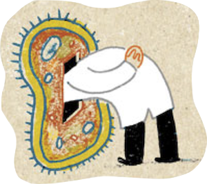
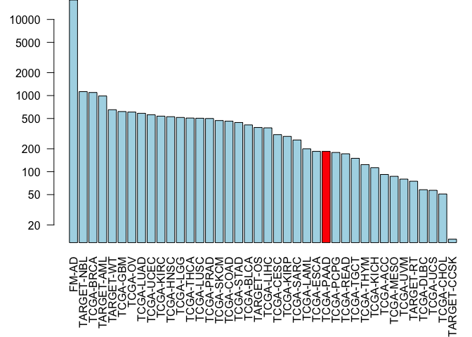
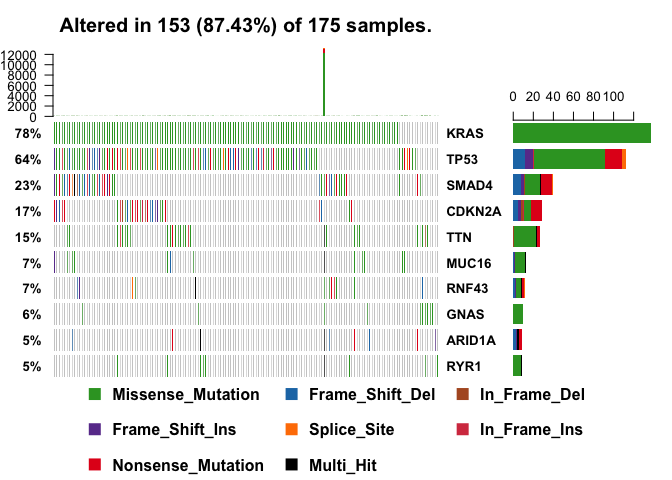

Investigating cancer genomics datasets
================

**BIMM-143 Lecture 18:**
Barry Grant &lt; <http://thegrantlab.org> &gt;
Date: 2018-03-07 (15:24:21 PST on Wed, Mar 07)
{:.message}

Cancer is fundamentally a disease of the genome, caused by changes in the DNA, RNA, and proteins of a cell that push cell growth into overdrive. Identifying the genomic alterations that arise in a given cancer can help researchers decode how a particular cancer develops and improve upon the diagnosis and treatment of cancers based on their distinct molecular abnormalities.



With the ability to sequence whole genomes and exomes, attention has turned to trying to understand the full spectrum of genetic mutations that underlie cancer.

The genomes or exomes of tens of thousands of cancers have now been sequenced. Analyzing this data can yield important new insights into cancer biology. This is important because it is estimated that cancer will strike 40% of people at some point in their lifetime with frequently devastating effects.

The NCI Genomic Data Commons
----------------------------

The National Cancer Institute (NCI) in the US has established the [**Genomic Data Commons**](https://gdc.cancer.gov/about-gdc) (or **GDC** for short) for sharing cancer genomics data-sets.

This includes data from the large scale projects such as **Cancer Genome Atlas** (TCGA) and other projects. The TGCA project aims to generate comprehensive, multi-dimensional maps of the key genomic changes in major types and sub-types of cancer. As of writing, TCGA has analyzed matched tumor and normal tissues from over 11,000 patients covering 33 cancer types and sub-types.

You can get a feel for the types of cancer data contained in the NCI-GDC by visiting their web portal: <https://portal.gdc.cancer.gov>.

Section 1. Exploring the GDC online
-----------------------------------

Visit the NCI-GDC web portal and enter p53 into the search box.

> **Q1**. How many *Cases* (i.e. patient samples) have been found to have p53 mutations?

> **Q2**. What are the top 6 misssense mutations found in this gene? <br> **HINT:** Scroll down to the 'TP53 - Protein' section and mouse over the displayed plot. For example **R175H** is found in 156 cases.

> **Q3**. Which domain of the protein (as annotated by PFAM) do these mutations reside in?

> **Q4**. What are the top 6 *primary sites* (i.e. cancer locations such as Lung, Brain, etc.) with p53 mutations and how many *primary sites* have p53 mutations been found in? <br> **HINT:** Clicking on the number links in the *Cancer Distribution* section will take you to a summary of available data accross *cases*, *genes*, and *mutations* for p53. Looking at the *cases* data will give you a ranked listing of *primary sites*.

Return to the NCI-GDC homepage and using a similar search and explore strategy answer the following questions:

> **Q5**. What is the most frequentely mutated position associated with cancer in the **KRas** protein (i.e. the amino acid with the most mutations)?

> **Q6**. Are KRas mutations common in Pancreatic Adenocarcinoma (i.e. is the Pancreas a common '*primary site*' for KRas mutations?).

> **Q6**. What is the '*TGCA project*' with the most KRas mutations?

> **Q7**. What precent of cases for this '*TGCA project*' have KRas mutations and what precent of cases have p53 mutations? <br> **HINT:** Placing your mouse over the project bar in the **Cancer Distribution** panel will bring up a tooltip with useful summary data.

> **Q8**. How many TGCA Pancreatic Adenocarcinoma *cases* (i.e. patients from the TCGA-PAAD project) have RNA-Seq data available?

By now it should be clear that the NCI-GDC is a rich source of both genomic and clinical data for a wide range of cancers. For example, at the time of writing there are 4,434 files associated with Pancreatic Adenocarcinoma and 11,824 for Colon Adenocarcinoma. These include RNA-Seq, WXS (whole exome sequencing), Methylation and Genotyping arrays as well as well as rich metadata associated with each case, file and biospecimen.

Section 2. The GenomicDataCommons R package
-------------------------------------------

The [GenomicDataCommons](https://bioconductor.org/packages/release/bioc/html/GenomicDataCommons.html) Bioconductor package provides functions for querying, accessing, and mining the NCI-GDC in R. Using this package allows us to couple large cancer genomics data sets (for example the actual RNA-Seq, WXS or SNP data) directly to the plethora of state-of-the-art bioinformatics methods available in R. This is important because it greatly facilitates both targeted and exploratory analysis of molecular cancer data well beyond that accessible via a web portal.

This section highlights how one can couple the [GenomicDataCommons](https://bioconductor.org/packages/release/bioc/html/GenomicDataCommons.html) and [maftools](https://bioconductor.org/packages/release/bioc/html/maftools.html) bioconductor packages to quickly gain insight into public cancer genomics data-sets.

We will first use functions from the `GenomicDataCommons` package to identify and then fetch somatic variant results from the NCI-GDC and then provide a high-level assessment of those variants using the `maftools` package. The later package works with [Mutation Annotation Format](https://wiki.nci.nih.gov/display/TCGA/Mutation+Annotation+Format+(MAF)+Specification) or **MAF** format files used by GDC and others to store somatic variants.

The workflow will be:

-   Install packages if not already installed
-   Load libraries
-   Identify and download somatic variants for a representative TCGA dataset, in this case pancreatic adenocarcinoma.
-   Use maftools to provide rich summaries of the data.

``` r
source("https://bioconductor.org/biocLite.R")
biocLite(c("GenomicDataCommons", "maftools"))
```

Once installed, load the packages, as usual.

``` r
library(GenomicDataCommons)
library(maftools)
```

Now lets check on GDC status:

``` r
GenomicDataCommons::status()
```

    ## $commit
    ## [1] "5b0e778f1d25f01a38b2c532f52c80527d57da1b"
    ## 
    ## $data_release
    ## [1] "Data Release 10.1 - February 15, 2018"
    ## 
    ## $status
    ## [1] "OK"
    ## 
    ## $tag
    ## [1] "1.13.0"
    ## 
    ## $version
    ## [1] 1

If this statement results in an error such as `SSL connect error`, then please see the [troubleshooting section here](https://bioconductor.org/packages/release/bioc/vignettes/GenomicDataCommons/inst/doc/overview.html#ssl-connection-errors).

Section 3. Querying the GDC from R
----------------------------------

We will typically start our interaction with the GDC by searching the resource to find data that we are interested in investigating further. In GDC speak is is called *"Querying GDC metadata"*. Metadata here refers to the extra descriptive information associated with the actual patient data (i.e. 'cases') in the GDC.

> **For example**: Our query might be '**find how many patients were studied for each major project**' or '**find and download all gene expression quantification data files for all pancreatic cancer patients**'. We will answer both of these questions below.

The are four main sets of metadata that we can query with this package, namely `cases()`, `projects()`, `files()`, and `annotations()`. We will start with `cases()` and use an example from the package associated [publication](https://www.biorxiv.org/content/biorxiv/early/2017/04/04/117200.full.pdf) to answer our first question above (i.e. find the number of cases/patients across different projects within the GDC):

``` r
cases_by_project <- cases() %>%
  facet("project.project_id") %>%
  aggregations()
head(cases_by_project)
```

    ## $project.project_id
    ##            key doc_count
    ## 1        FM-AD     18004
    ## 2   TARGET-NBL      1127
    ## 3    TCGA-BRCA      1098
    ## 4   TARGET-AML       988
    ## 5    TARGET-WT       652
    ## 6     TCGA-GBM       617
    ## 7      TCGA-OV       608
    ## 8    TCGA-LUAD       585
    ## 9    TCGA-UCEC       560
    ## 10   TCGA-KIRC       537
    ## 11   TCGA-HNSC       528
    ## 12    TCGA-LGG       516
    ## 13   TCGA-THCA       507
    ## 14   TCGA-LUSC       504
    ## 15   TCGA-PRAD       500
    ## 16   TCGA-SKCM       470
    ## 17   TCGA-COAD       461
    ## 18   TCGA-STAD       443
    ## 19   TCGA-BLCA       412
    ## 20   TARGET-OS       381
    ## 21   TCGA-LIHC       377
    ## 22   TCGA-CESC       307
    ## 23   TCGA-KIRP       291
    ## 24   TCGA-SARC       261
    ## 25   TCGA-LAML       200
    ## 26   TCGA-ESCA       185
    ## 27   TCGA-PAAD       185
    ## 28   TCGA-PCPG       179
    ## 29   TCGA-READ       172
    ## 30   TCGA-TGCT       150
    ## 31   TCGA-THYM       124
    ## 32   TCGA-KICH       113
    ## 33    TCGA-ACC        92
    ## 34   TCGA-MESO        87
    ## 35    TCGA-UVM        80
    ## 36   TARGET-RT        75
    ## 37   TCGA-DLBC        58
    ## 38    TCGA-UCS        57
    ## 39   TCGA-CHOL        51
    ## 40 TARGET-CCSK        13

Note that the **facet()** and **aggregations()** functions here are from the `GenomicDataCommons` package and act to group all cases by the project id and then count them up.

If you use the **View()** fuction on our new `cases_by_project` object you will find that the data we are after is accessibe via `cases_by_project$project.project_id`.

> **Q9**. Write the R code to make a barplot of the cases per project. Lets plot this data with a log scale for the y axis (`log="y"`), rotated axis labels (`las=2`) and color the bar coresponding to the TCGA-PAAD project.



Lets take another snippet of code from their package vignette and adapt it to answer or second question from above - namely '*find all gene expression data files for all pancreatic cancer patients*':

``` r
## This code snipet is taken from the package vignette
file_records <- files() %>%
  filter(~ cases.project.project_id == "TCGA-PAAD" &
    data_type == "Gene Expression Quantification" &
    analysis.workflow_type == "HTSeq - Counts") %>%
  response_all()
```

The above R code was copied from the package documentation and all we have changed is the addition of our 'TCGA-PAAD' project to focus on the TGCA pancreatic cancer project related data. We will learn more about were the various names and options such as `analysis.workflow_type` etc. come from below (basically they are from CDG database itself!).

In RStudio we can now use the **View()** function to get a feel for the data organization and values in the returned `file_records` object.

``` r
View(file_records)
```

We should see that `file_records$results` contains a row for every RNA-Seq data file from the 'TCGA-PAAD' project. At the time of writing this was 182 RNA-Seq data files.

We could download these with standard R tools, or for larger data-sets such as this one, use the packages **transfer()** function, which uses the GDC transfer client (a separate command-line tool) to perform more robust data downloads.

Section 4. Variant analysis with R
----------------------------------

Note we could go to the NCI-GDC web portal and enter the [Advanced Search page](https://portal.gdc.cancer.gov/query) and then construct a search query to find MAF format somatic mutation files for our 'TCGA-PAAD' project.

After some exploration of the website I came up with the following query: "`cases.project.project_id in ["TCGA-PAAD"] and files.data_type in ["Masked Somatic Mutation"] and files.data_format in ["MAF"]`".

> **Q9**. How many MAF files for the TCGA-PAAD project were found from this advanced web search?

Lets do the same search in R with the **files()** function from the `GenomicDataCommons` package. We will be searching based on `data_type`, `data_format`, and `analysis.workflow_type`. The last term here will focus on only one of the MAF files for this project in GDC, namely the MuTect2 workflow variant calls.

``` r
maf.files = files() %>%
    filter(~ cases.project.project_id == 'TCGA-PAAD' &
        data_type == 'Masked Somatic Mutation' &
        data_format == "MAF" &
        analysis.workflow_type == "MuTect2 Variant Aggregation and Masking"
    ) %>%
    response_all()
```

``` r
View(maf.files)
```

``` r
head(maf.files$results)
```

    ##                 data_type                 updated_datetime
    ## 1 Masked Somatic Mutation 2017-12-20T14:05:23.247427-06:00
    ##                                                                      file_name
    ## 1 TCGA.PAAD.mutect.fea333b5-78e0-43c8-bf76-4c78dd3fac92.DR-10.0.somatic.maf.gz
    ##                           submitter_id
    ## 1 TCGA-PAAD-mutect-public_10.0_new_maf
    ##                                file_id file_size
    ## 1 fea333b5-78e0-43c8-bf76-4c78dd3fac92   6991687
    ##                                     id                 created_datetime
    ## 1 fea333b5-78e0-43c8-bf76-4c78dd3fac92 2017-12-01T17:52:47.832941-06:00
    ##                             md5sum data_format  acl access     state
    ## 1 cdddbf7bc36774e85a5033ad1be223ba         MAF open   open submitted
    ##                 data_category                    type file_state
    ## 1 Simple Nucleotide Variation masked_somatic_mutation  submitted
    ##   experimental_strategy
    ## 1                   WXS

> **Q10**. What line in the above code would you modify to return all MAF files for the TCGA-PAAD project?

We will use the **ids()** function to pull out the unique identifier for our MAF file

``` r
uid <- ids(maf.files)
uid
```

    ## [1] "fea333b5-78e0-43c8-bf76-4c78dd3fac92"

Once we have the unique identifier(s) (in this case, only fea333b5-78e0-43c8-bf76-4c78dd3fac92), the **gdcdata()** function downloads the associated files and returns a file-name for each identifier.

``` r
maffile = gdcdata(uid, destination_dir =".")
maffile
```

    ##                                             fea333b5-78e0-43c8-bf76-4c78dd3fac92 
    ## "./TCGA.PAAD.mutect.fea333b5-78e0-43c8-bf76-4c78dd3fac92.DR-10.0.somatic.maf.gz"

### MAF analysis

The MAF file is now stored locally and the maftools package workflow, which starts with a MAF file, can proceed, starting with reading the pancreatic cancer MAF file.

``` r
vars = read.maf(maf = maffile, verbose = FALSE)
```

    ## reading maf..

    ## Done !

With the data now available as a **maftools** MAF object, a lot of functionality is available with little code. While the maftools package offers quite a few functions, here are a few highlights. Cancer genomics and bioinformatics researchers will recognize these plots:

### Plotting MAF summary.

We can use `plotmafSummary()` function to plot a summary of the maf object, which displays number of variants in each sample as a stacked barplot and variant types as a boxplot summarized by Variant\_Classification. We can add either mean or median line to the stacked barplot to display average/median number of variants across the cohort.

``` r
plotmafSummary(maf =vars, rmOutlier = TRUE,
               addStat = 'median', dashboard = TRUE,
               titvRaw = FALSE)
```

    ## Warning: Removed 9 rows containing non-finite values (stat_boxplot).


### Drawing oncoplots

A very useful summary representation of this data can be obtained via so-called *oncoplots*, also known as *waterfall plots*.

``` r
oncoplot(maf = vars, top = 10)
```



You might need to zoom display on the oncoplot() output to see the full plot. You could also send your plot to a PNG or PDF plot device:

``` r
# Oncoplot for our top 10 most frequently mutated genes
pdf("oncoplot_panc.pdf")
oncoplot(maf = vars, top = 10, fontSize = 12)
dev.off()
```

    ## quartz_off_screen 
    ##                 2

> **NOTE**: The **oncoplot()** function is a wrapper around ComplexHeatmap's `OncoPrint()` function with little modification and automation which makes plotting easier. The side and top barplots can be controlled by `drawRowBar()` and `drawColBar()` arguments respectively. There are lots of other customization options as usual with R graphics.

> **NOTE**: Variants annotated as Multi\_Hit are those genes which are mutated more than once in the same sample.

oncostrip
---------

We can visualize any set of genes using oncostrip function, which draws mutations in each sample similar to OncoPrinter tool on NCI-GDC web portal. oncostrip can be used to draw any number of genes using top or genes arguments

``` r
oncostrip(maf=vars, genes=c("KRAS", "TP53"))
```


Another plot focusing on KRAS in our particular dataset.

``` r
kras.lpop = lollipopPlot(maf = vars, gene = 'KRAS', 
                         showMutationRate = TRUE, domainLabelSize = 3)
```

    ## Assuming protein change information are stored under column HGVSp_Short. Use argument AACol to override if necessary.

    ## 2 transcripts available. Use arguments refSeqID or proteinID to manually specify tx name.

    ##    HGNC refseq.ID protein.ID aa.length
    ## 1: KRAS NM_004985  NP_004976       188
    ## 2: KRAS NM_033360  NP_203524       189

    ## Using longer transcript NM_033360 for now.


Lets do one for p53 also

``` r
p53.lpop = lollipopPlot(maf = vars, gene = 'TP53')
```

    ## Assuming protein change information are stored under column HGVSp_Short. Use argument AACol to override if necessary.

    ## 8 transcripts available. Use arguments refSeqID or proteinID to manually specify tx name.

    ##    HGNC    refseq.ID   protein.ID aa.length
    ## 1: TP53    NM_000546    NP_000537       393
    ## 2: TP53 NM_001126112 NP_001119584       393
    ## 3: TP53 NM_001126118 NP_001119590       354
    ## 4: TP53 NM_001126115 NP_001119587       261
    ## 5: TP53 NM_001126113 NP_001119585       346
    ## 6: TP53 NM_001126117 NP_001119589       214
    ## 7: TP53 NM_001126114 NP_001119586       341
    ## 8: TP53 NM_001126116 NP_001119588       209

    ## Using longer transcript NM_000546 for now.


Summary
-------

Additional functionality is available for both the `GenomicDataCommons` and `maftools` packages not to mention the 100's of other bioinformatics R packages that can now work with this type of data in both exploratory and targeted analysis modes.

The purpose of this hands-on session was to highlight how one can leverage two such packages to quickly gain insight into public cancer genomics data-sets. Hopefully this will inspire your further exploration of these and other bioinformatics R packages.
